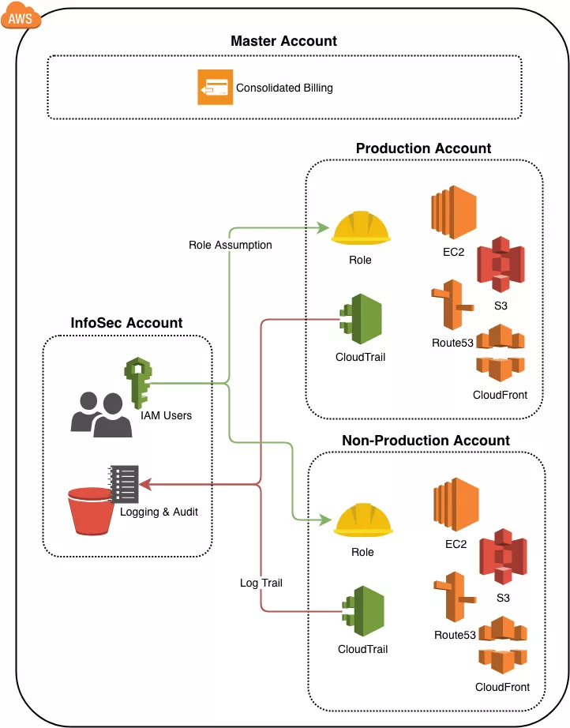

# AWS Organization Terraform

This repository contains the Terraform configurations needed to bootstrap and manage a multi-account AWS organization. It also includes the various roles required within the accounts.

At Hypr, we use this as the foundation for our client AWS accounts. We then create a separate repository that contains the actual users and resources used in the organization.

To achieve a more secure AWS account structure, we take advantage of [AWS Organizations](https://aws.amazon.com/organizations) to structure our AWS accounts and resources in a more manageable way with granular security controls. The implementation chosen is a hybrid multi-account structure that provides substantial security benefits by separating Identity and Access Management (IAM) from actual AWS resources.

In this secure AWS account structure, a Master account manages the billing for the organization. All IAM users exist in an InfoSec account, and users use [role assumption](https://docs.aws.amazon.com/IAM/latest/UserGuide/id_roles.html) to access resources in the various accounts. You provision resources in either the Production or Non-Production accounts. Each account has [CloudTrail](https://aws.amazon.com/cloudtrail/) configured for auditing activity within the account, and a log trail stores the logs in the InfoSec account.

Be sure to modify `shared.yaml` to customize the configuration for your organization.

## Prerequisites

- [Terraform](https://www.terraform.io/)
- [Terragrunt](https://github.com/gruntwork-io/terragrunt)
- [Keybase](https://keybase.io) account (required during initialization and runs involving the temporary admin user)

## Initialization

The [master](master) folder contains bootstrap instructions for creating the initial organization structure and resources

## Post-Initialization

Future Terraform runs must be run by an IAM user in the Infosec account with the appropriate group assignment for the target account:

- Infosec account: `InfosecAdmins` group
- Prod account: `ProdAdmins` group
- Non-Prod account: `NonProdAdmins` group

This repository and the patterns we use owe a lot to work done by Litario Engineers, who open-sourced their solution and shared their approach in a blog post: [Secure AWS Account Structure with Terraform and Terragrunt](https://www.liatrio.com/blog/secure-aws-account-structure-with-terraform-and-terragrunt)
